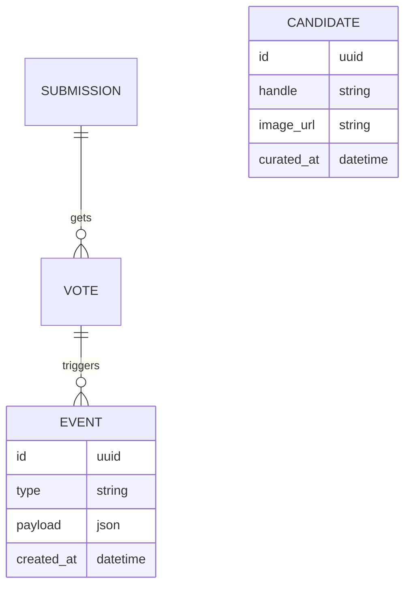

# Module 3 — V3 Automation (Signals, Bots & Ops)

**Projekt:** $BART / Bad Art — Real Artist  
**Stand:** 2025-09-28 21:17  
**Ziel dieses Moduls:** Wiederkehrende Aufgaben automatisieren (Posting, Zähler, Exporte), Datenflüsse stabilisieren und Risikokontrollen einziehen.

---

## 1) Automations‑Kategorien
- **Social Signals:** Auto‑Posts bei **25/50/75/100%** Vote‑Fortschritt; Status‑Grafiken generieren.  
- **Voting Sync:** Web‑Vote ↔ X‑Poll Spiegelung (wenn möglich) + Abgleich/Logging.  
- **Assets‑Pipeline:** Thumbnails, Watermarks, Overlay‑Composer (Society‑Green, Slogans).  
- **Metrics Export:** Daily CSV/JSON (Submissions, Votes, Shares, CTR).

## 2) Trigger & Regeln (Beispiele)
```yaml
triggers:
  - name: "vote_milestone"
    when: "vote_pct in [25,50,75,100]"
    actions:
      - "render_social_card(candidate_ids)"
      - "post_to_x(thread_id)"
      - "log_event('milestone', payload)"
  - name: "round_start"
    when: "schedule: Mon 10:00"
    actions:
      - "publish_theme(theme_id)"
      - "open_submissions()"
  - name: "round_end"
    when: "timer_expired"
    actions:
      - "close_submissions()"
      - "promote_winner_to_hof()"
```

## 3) Datenmodell (Kurz)

*(Mermaid optional; bei GitHub‑Preview sichtbar.)*

## 4) Ops & Reliability
- **Idempotent:** Aktionen mehrmals auslösbar ohne Doppelpost.  
- **Rate‑Limits:** X/TG API‑Quoten respektieren; Backoff.  
- **Audit‑Log:** Jede Automation schreibt **EVENT** mit Payload & Ergebnis.  
- **Secrets:** API‑Keys via ENV; Rotationsplan.

## 5) Playbooks (Störung)
- **Posting schlägt fehl:** Retry 3×, dann manueller Fallback (Template).  
- **Vote‑Sync driftet:** Lock Runde, Diff‑Report, Korrekturpost.  
- **Bild‑Render defekt:** Platzhalter‑Card + späteres Update.

## 6) KPIs
- **SLA Milestone‑Post < 2 min**, **Fehlerquote < 1%**, **Mean Time to Repair**, **Deckungsgleichheit Web↔X**.

## 7) Checkliste „Go‑Live“
- [ ] Sandbox‑Keys & Rate‑Tests bestanden.  
- [ ] Idempotenz‑Tests je Trigger.  
- [ ] Audit‑Log sichtbar (Dashboard).  
- [ ] On‑Call‑Schema & Playbooks dokumentiert.
